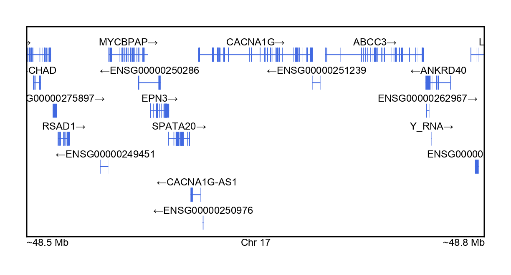
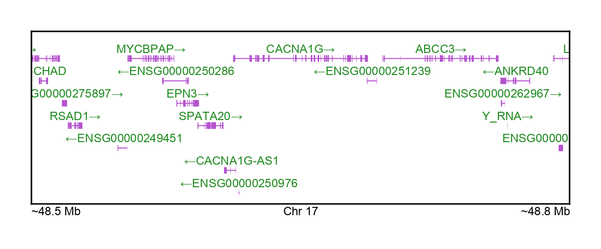
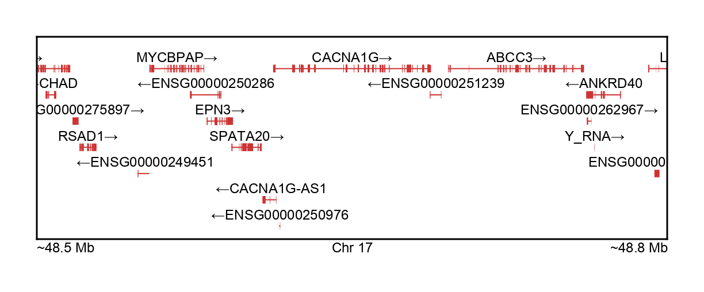
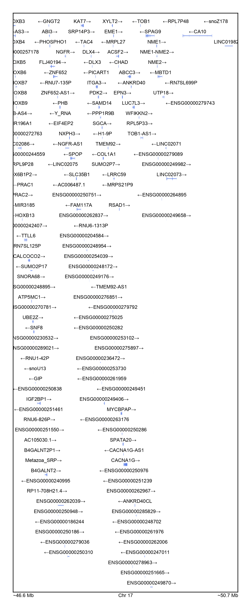
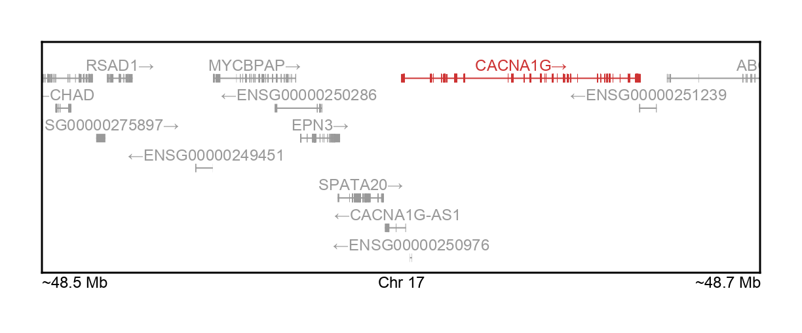
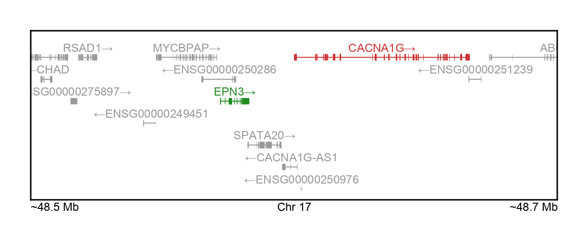
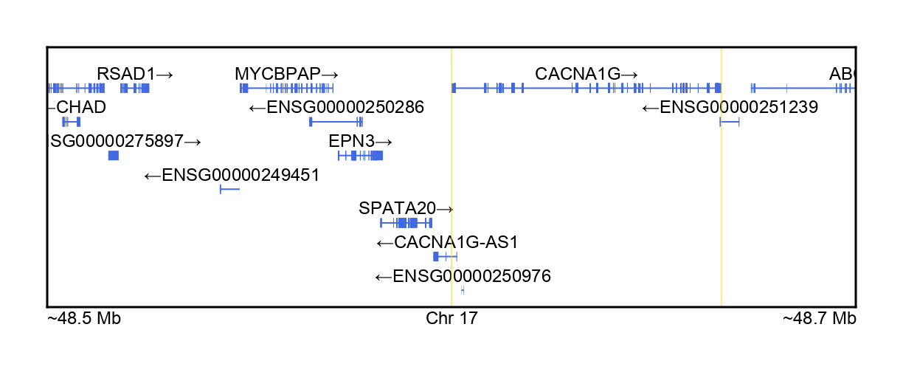

# Plotting genes

After [Parsing GENCODE](@ref), we can start plotting gene bodies. 
[__GeneticsMakie.jl__](https://github.com/mmkim1210/GeneticsMakie.jl) is transparent 
in that it shows all genes within a genomic window.

```julia
using Pkg
Pkg.add("CairoMakie")
```

We can focus on _CACNA1G_ gene as our initial example. We can use `GeneticsMakie.plotgenes!` 
to plot all genes within a given chromosome and ± 100 Kb window around gene start and stop sites. 
We can then use `GeneticsMakie.labelgenome` to label the genomic range.

```julia
using CairoMakie
isdir("figs") || mkdir("figs")
set_theme!(font = "Arial")

gene = "CACNA1G"
chr, start, stop = GeneticsMakie.findgene(gene, gencode)
f = Figure(resolution = (306, 792))
ax = Axis(f[1, 1])
rs = GeneticsMakie.plotgenes!(ax, chr, start - 1e5, stop + 1e5, gencode)
GeneticsMakie.labelgenome(f[1, 1, Bottom()], chr, start - 1e5, stop + 1e5)
rowsize!(f.layout, 1, rs)
resize_to_layout!(f)
f
```


We can adjust the height of exons using the `height` keyword argument.
```julia
f = Figure(resolution = (306, 792))
ax = Axis(f[1, 1])
rs = GeneticsMakie.plotgenes!(ax, chr, start - 1e5, stop + 1e5, gencode; height = 0.1)
GeneticsMakie.labelgenome(f[1, 1, Bottom()], chr, start - 1e5, stop + 1e5)
rowsize!(f.layout, 1, rs)
resize_to_layout!(f)
f
```


We can change the color of genes and text using the `genecolor` and `textcolor` keyword arguments, respectively.
```julia
f = Figure(resolution = (306, 792))
ax = Axis(f[1, 1])
rs = GeneticsMakie.plotgenes!(ax, chr, start - 1e5, stop + 1e5, gencode; height = 0.1, genecolor = :mediumorchid3, textcolor = :forestgreen)
GeneticsMakie.labelgenome(f[1, 1, Bottom()], chr, start - 1e5, stop + 1e5)
rowsize!(f.layout, 1, rs)
resize_to_layout!(f)
f
```


Alternatively, we can visualize this locus by passing `gene` as a positional argument and 
`window` as a keyword argument.
```julia
f = Figure(resolution = (306, 792))
ax = Axis(f[1, 1])
rs = GeneticsMakie.plotgenes!(ax, gene, gencode; window = 1e5, height = 0.1, genecolor = :brown3)
GeneticsMakie.labelgenome(f[1, 1, Bottom()], chr, start - 1e5, stop + 1e5)
rowsize!(f.layout, 1, rs)
resize_to_layout!(f)
f
```


There is no limit to the number of genes we can visualize. Below we visualize a larger 
± 2 Mb window around `gene`.
```julia
f = Figure(resolution = (306, 792))
ax = Axis(f[1, 1])
rs = GeneticsMakie.plotgenes!(ax, gene, gencode; window = 2e6, height = 0.1)
GeneticsMakie.labelgenome(f[1, 1, Bottom()], chr, start - 2e6, stop + 2e6)
rowsize!(f.layout, 1, rs)
resize_to_layout!(f)
f
```


!!! note "Gene density"
    As some regions have higher gene density than the others, it would be wise (for
    publication purpose) to visualize a smaller genomic window for such gene-dense regions.

We can highlight a gene or sets of genes as below. This can be useful when highlighting genes 
by certain properties such as those that are protein coding or those that are 
[loss-of-function intolerant](https://gnomad.broadinstitute.org/) or those that are 
significant in some sort of gene-level association. 

```julia
f = Figure(resolution = (306, 792))
ax = Axis(f[1, 1])
rs = GeneticsMakie.plotgenes!(ax, chr, start, (gene, :brown3), gencode; window = 1e5, height = 0.1)
GeneticsMakie.labelgenome(f[1, 1, Bottom()], chr, start - 1e5, start + 1e5)
rowsize!(f.layout, 1, rs)
resize_to_layout!(f)
f
```


```julia
f = Figure(resolution = (306, 792))
ax = Axis(f[1, 1])
rs = GeneticsMakie.plotgenes!(ax, chr, start, ([gene, "EPN3"], [:brown3, :forestgreen]), gencode; window = 1e5, height = 0.1)
GeneticsMakie.labelgenome(f[1, 1, Bottom()], chr, start - 1e5, start + 1e5)
rowsize!(f.layout, 1, rs)
resize_to_layout!(f)
f
```


Finally, we can make additional modifications on top of the figure as needed using
[__Makie.jl__](https://makie.juliaplots.org/stable/).

```julia
f = Figure(resolution = (306, 792))
ax = Axis(f[1, 1])
rs = GeneticsMakie.plotgenes!(ax, chr, start, gencode; window = 1e5, height = 0.1)
GeneticsMakie.labelgenome(f[1, 1, Bottom()], chr, start - 1e5, start + 1e5)
rowsize!(f.layout, 1, rs)
resize_to_layout!(f)
vlines!(ax, start, color = (:gold, 0.5), linewidth = 0.5)
vlines!(ax, stop, color = (:gold, 0.5), linewidth = 0.5)
f
```
