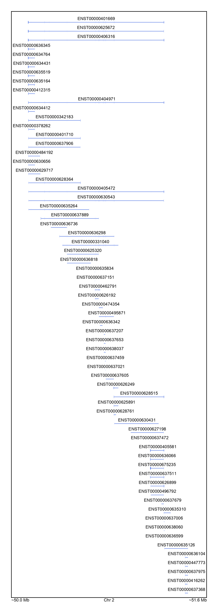
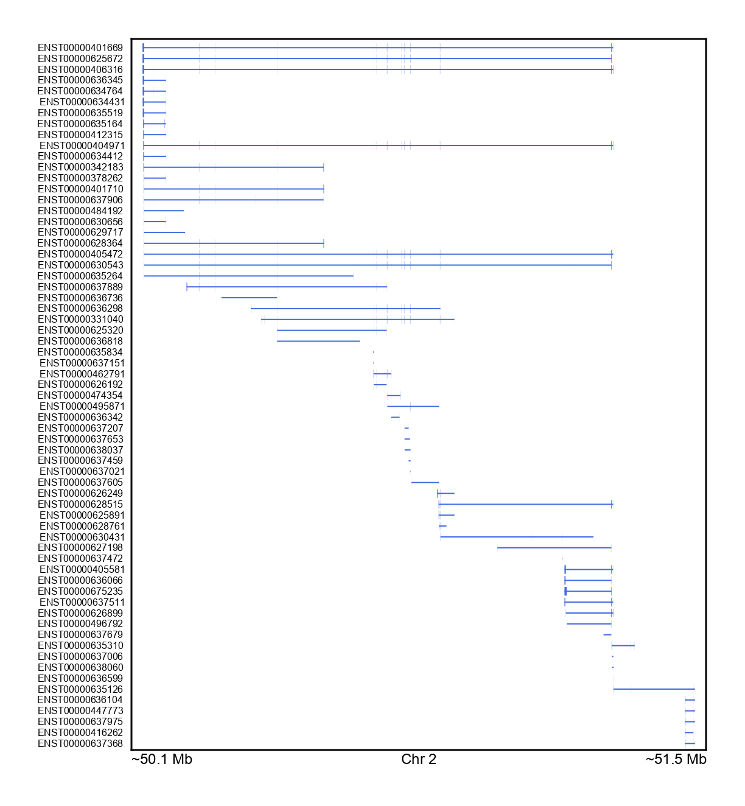
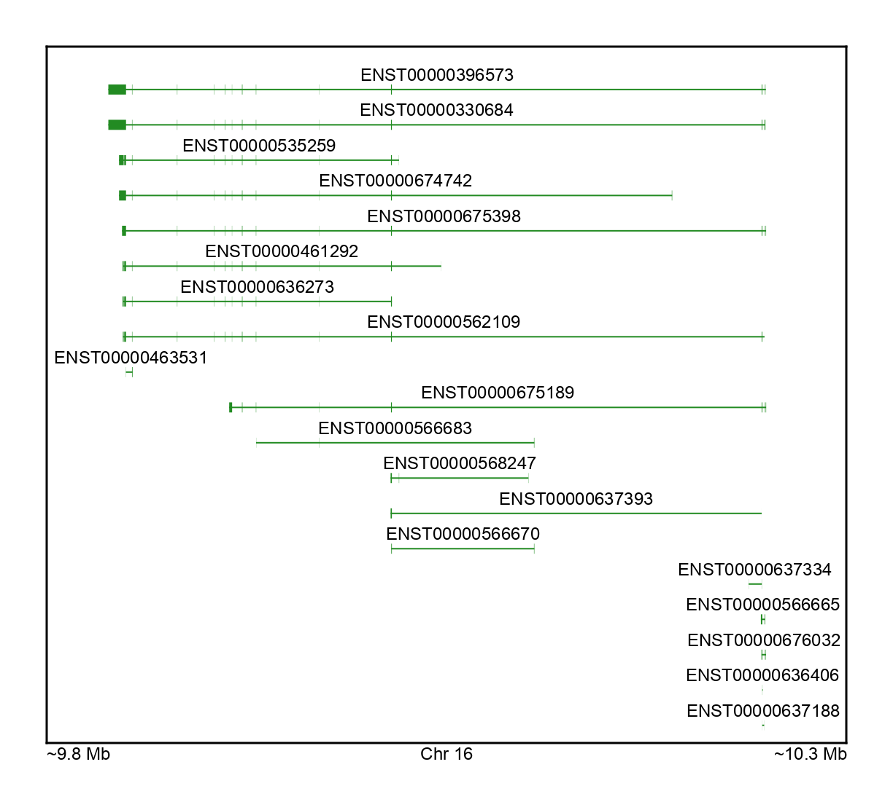
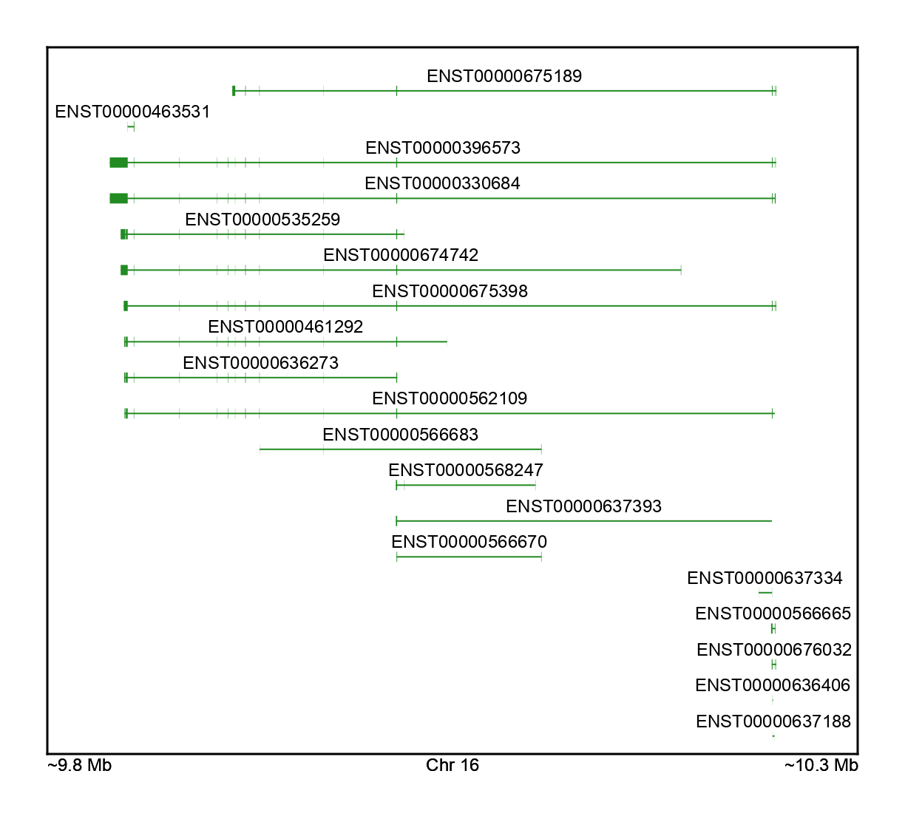

# Plotting isoforms

We can focus on _NRXN1_ gene as our initial example. `GeneticsMakie.plotisoforms!` returns 
genomic coordinates for the gene of interest so that an appropriate label can be passed onto 
`GeneticsMakie.labelgenome`. _NRXN1_ gene has many isoforms as we see below, and even more 
isoforms are likely to be discovered in the future. For this reason, plotting isoforms of multiple genes is not available. 

```julia
gene = "NRXN1"
f = Figure(resolution = (306, 792))
ax = Axis(f[1, 1])
rs, chr, range1, range2 = GeneticsMakie.plotisoforms!(ax, gene, gencode; height = 0.1)
GeneticsMakie.labelgenome(f[1, 1, Bottom()], chr, range1, range2)
rowsize!(f.layout, 1, rs)
resize_to_layout!(f)
f
```


To save some space, we can plot the isoform labels on the left by using the `text` keyword argument. 

```julia
gene = "NRXN1"
f = Figure(resolution = (306, 792))
ax = Axis(f[1, 1])
rs, chr, range1, range2 = GeneticsMakie.plotisoforms!(ax, gene, gencode; height = 0.1, text = :l)
GeneticsMakie.labelgenome(f[1, 1, Bottom()], chr, range1, range2)
rowsize!(f.layout, 1, rs)
resize_to_layout!(f)
f
```


We can change the color of isoforms and text using the `isoformcolor` and `textcolor` keyword arguments, respectively.
We look at a different gene, _GRIN2A_.

```julia
gene = "GRIN2A"
f = Figure(resolution = (306, 792))
ax = Axis(f[1, 1])
rs, chr, range1, range2 = GeneticsMakie.plotisoforms!(ax, gene, gencode; isoformcolor = :forestgreen, height = 0.1)
GeneticsMakie.labelgenome(f[1, 1, Bottom()], chr, range1, range2)
rowsize!(f.layout, 1, rs)
resize_to_layout!(f)
f
```


We can change the order of isoforms by using the `orderby` keyword argument.

```julia
f = Figure(resolution = (306, 792))
ax = Axis(f[1, 1])
rs, chr, range1, range2 = GeneticsMakie.plotisoforms!(ax, gene, gencode; orderby = ["ENST00000675189", "ENST00000463531"], isoformcolor = :forestgreen, height = 0.1)
GeneticsMakie.labelgenome(f[1, 1, Bottom()], chr, range1, range2)
rowsize!(f.layout, 1, rs)
resize_to_layout!(f)
f
```
